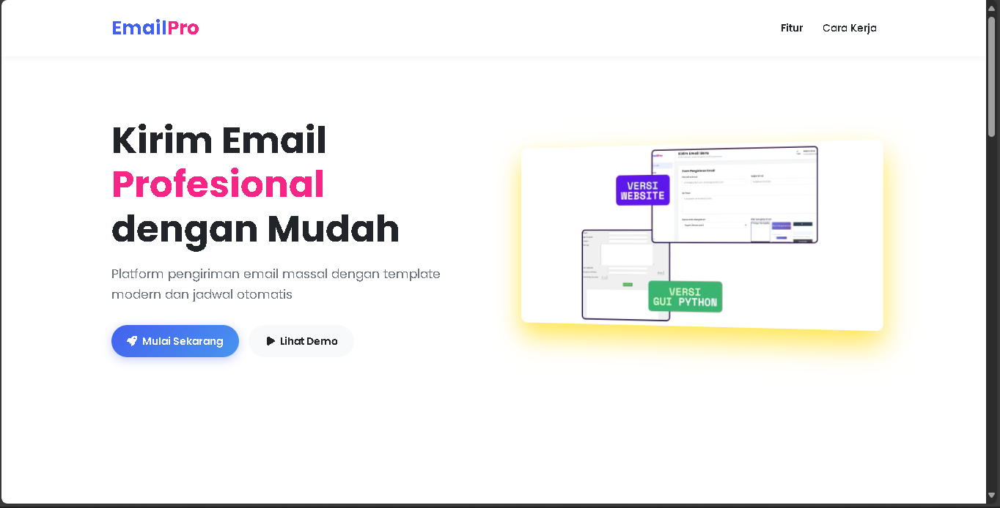
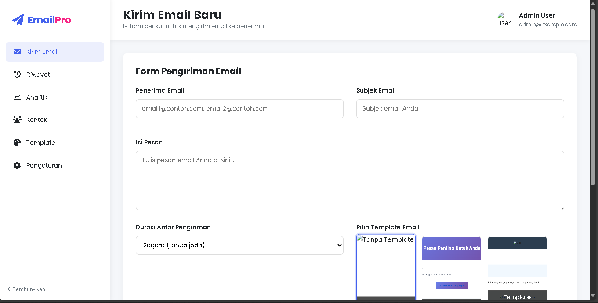

# **📮 EmailSender Pro - README**  

**🚀 "Gausah pusing kirim email massal, tinggal klik, BOOM! Terkirim!"**  

Sebuah tool keren buat lo yang sering kirim email ke banyak orang. Dibikin pake **Node.js + Express**, dengan desain UI/UX kekinian dan fitur template email yang mantul!  

---

## **✨ Fitur-Fitur Keren**  

✅ **Kirim Email Massal** - Bisa masukin banyak penerima sekaligus, dipisah pake koma.  
✅ **Template Keren** - Udah disediain 3 template email yang kekinian (tinggal pilih).  
✅ **Dashboard Modern** - UI/UX ciamik, animasi smooth, dan responsif di semua device.  
✅ **Rate Limiting** - Biar gak kebanyakan kirim email, ada batasannya.  

---

## **🖼️ Preview Aplikasi**  

### **1. Landing Page (Tampilan Utama)**  
  
*"Desain modern, animasi keren, langsung pengen pake!"*  

### **2. Dashboard (Halaman Kirim Email)**  
  
*"Gampang banget tinggal isi form, pilih template, terus kirim!"*  

---

## **🛠️ Cara Pasang & Jalankan**  

### **1. Clone Repo**  
```bash
git clone https://github.com/YoshCasaster/web-gmail-sender.git
cd web-gmail-sender
```

### **2. Install Dependencies**  
```bash
npm install
```

### **3. Setting `.env`**  
Bikin file `.env` dan isi kayak gini:  
```env
GMAIL_USER="emailkamu@gmail.com"
GMAIL_APP_PASSWORD="password-app-google"
GMAIL_NAME="Namalo"
PORT=3000
```

### **4. Jalankan Server**  
```bash
npm start
```
**Buka di browser:** [http://localhost:3000](http://localhost:3000)  

---

## **🚀 Cara Pake**  

1. **Buka Dashboard** → `/dashboard`  
2. **Isi Form:**  
   - 📩 Penerima (bisa banyak, pisah pake koma)  
   - 📌 Subjek email  
   - ✉️ Isi pesan  
   - ⏱️ Pilih durasi pengiriman  
   - 🎨 Pilih template (kalau mau)  
3. **Klik "Kirim Email Sekarang"** → Selesai! 🎉  

---

## **💡 Tips & Trick**  

🔹 **Buat Template Sendiri?**  
- Bisa edit file HTML di `public/templates/` (tersedia 3 template default).  

🔹 **Deploy ke Vercel?**  
- Udah ada config `vercel.json`, tinggal push ke repo terus deploy!  

🔹 **Gak Bisa Kirim?**  
- Pastikan pake **App Password** (bukan password biasa) di Google Account.  

---

## **📌 Kontribusi**  

Kalo mau nambah fitur atau benerin bug, **PR aja langsung!**  
Dibikin sama [@lo](https://github.com/YoshCasaster) dengan ❤️  

---

**🔥 "Gausah manual lagi, biar EmailSender Pro yang handle!"** 🚀